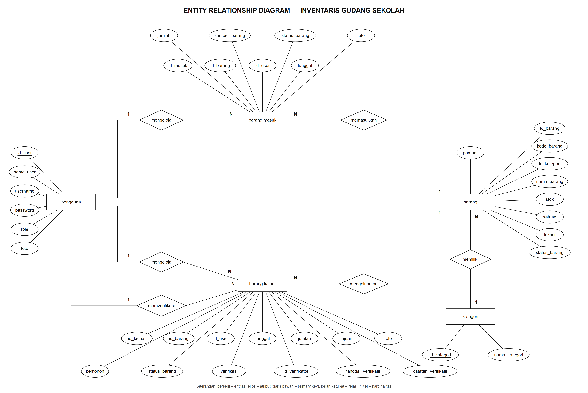
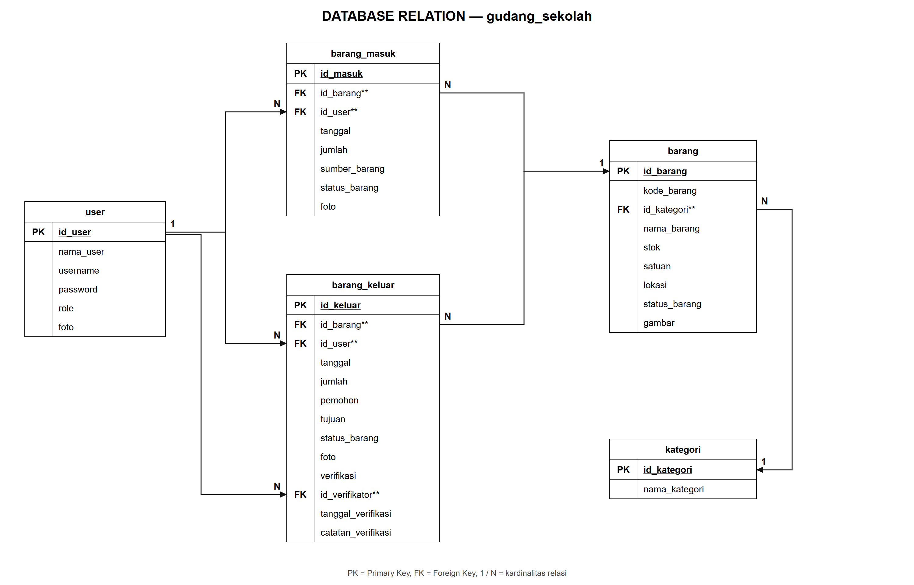

# Dokumen Rancangan Inventaris Gudang Sekolah

| No. Peserta | Nama Peserta | Aplikasi/Program | Skema |
|---|---|---|---|
| (diisi peserta) | Renaissance Ricarda Sugiarto Putra | Inventaris Gudang Sekolah | Pemrogram Junior (Junior Coder) |

Dokumen ini berisi rancangan basis data aplikasi Inventaris Gudang Sekolah: Entity Relationship Diagram, Desain Database, Database Relation, Kamus Data, dan Data Sampel. Isinya sama persis dengan struktur database pada program (folder `database/migrations`) dan data awal pada program (`database/seeders/DatabaseSeeder.php`).

<!-- daftar-isi -->

<!-- landscape -->

## 1. Entity Relationship Diagram

| No. Peserta | Nama Peserta | Aplikasi/Program | Dokumen |
|---|---|---|---|
| (diisi peserta) | Renaissance Ricarda Sugiarto Putra | Inventaris Gudang Sekolah | Entity Relationship Diagram |

Nama Database: **gudang_sekolah** · Jumlah Tabel: **5** (`user`, `kategori`, `barang`, `barang_masuk`, `barang_keluar`)

<!-- portrait -->

Penjelasan relasi pada ERD:

| No | Relasi | Kardinalitas | Penjelasan |
|---|---|---|---|
| 1 | pengguna **mengelola** barang masuk | 1 : N | Satu Operator dapat mencatat banyak barang masuk (kolom `barang_masuk.id_user`). |
| 2 | pengguna **mengelola** barang keluar | 1 : N | Satu Operator dapat mengajukan banyak barang keluar (kolom `barang_keluar.id_user`). |
| 3 | pengguna **memverifikasi** barang keluar | 1 : N | Satu Manager dapat memverifikasi banyak barang keluar (kolom `barang_keluar.id_verifikator`). |
| 4 | barang masuk **memasukkan** barang | N : 1 | Banyak transaksi masuk dapat merujuk satu barang (kolom `barang_masuk.id_barang`). |
| 5 | barang keluar **mengeluarkan** barang | N : 1 | Banyak transaksi keluar dapat merujuk satu barang (kolom `barang_keluar.id_barang`). |
| 6 | barang **memiliki** kategori | N : 1 | Banyak barang berada dalam satu kategori (kolom `barang.id_kategori`). |

<!-- halaman-baru -->

## 2. Desain Database

| No. Peserta | Nama Peserta | Aplikasi/Program | Dokumen |
|---|---|---|---|
| (diisi peserta) | Renaissance Ricarda Sugiarto Putra | Inventaris Gudang Sekolah | Desain Database |

Nama database: **gudang_sekolah**. Semua foreign key memakai aturan `ON DELETE RESTRICT` (data induk tidak dapat dihapus selama masih dipakai) dan `ON UPDATE CASCADE`.

### 2.1 Tabel `user`

| Nama Field | Tipe Data | Panjang | Keterangan |
|---|---|---|---|
| id_user | int | 11 | Primary Key, auto increment |
| nama_user | varchar | 100 | Nama lengkap pengguna |
| username | varchar | 50 | Unique, dipakai untuk login |
| password | varchar | 255 | Disimpan dalam bentuk hash bcrypt |
| role | enum | 'Admin','Operator','Manager' | Hak akses pengguna |
| foto | varchar | 255 | Lokasi file foto profil, boleh kosong |

### 2.2 Tabel `kategori`

| Nama Field | Tipe Data | Panjang | Keterangan |
|---|---|---|---|
| id_kategori | int | 11 | Primary Key, auto increment |
| nama_kategori | varchar | 20 | Unique |

### 2.3 Tabel `barang`

| Nama Field | Tipe Data | Panjang | Keterangan |
|---|---|---|---|
| id_barang | int | 11 | Primary Key, auto increment |
| kode_barang | varchar | 20 | Unique, dibuat otomatis (contoh AT-001) |
| id_kategori | int | 11 | Foreign Key → kategori.id_kategori |
| nama_barang | varchar | 100 | |
| stok | int | 11 | Jumlah barang tersedia |
| satuan | varchar | 20 | buah / unit / pack |
| lokasi | varchar | 100 | Tempat penyimpanan |
| status_barang | varchar | 30 | Baik / Rusak Ringan / Rusak Berat |
| gambar | varchar | 255 | Lokasi file gambar barang, boleh kosong |

### 2.4 Tabel `barang_masuk`

| Nama Field | Tipe Data | Panjang | Keterangan |
|---|---|---|---|
| id_masuk | int | 11 | Primary Key, auto increment |
| id_barang | int | 11 | Foreign Key → barang.id_barang |
| id_user | int | 11 | Foreign Key → user.id_user (Operator pencatat) |
| tanggal | date | | Tanggal barang diterima |
| jumlah | int | 11 | Minimal 1 |
| sumber_barang | varchar | 255 | Dana BOS / Pembelian / Bantuan Dinas |
| status_barang | varchar | 30 | Kondisi barang saat diterima |
| foto | varchar | 255 | Lokasi file foto bukti penerimaan, opsional |

### 2.5 Tabel `barang_keluar`

| Nama Field | Tipe Data | Panjang | Keterangan |
|---|---|---|---|
| id_keluar | int | 11 | Primary Key, auto increment |
| id_barang | int | 11 | Foreign Key → barang.id_barang |
| id_user | int | 11 | Foreign Key → user.id_user (Operator pengaju) |
| tanggal | date | | Tanggal pengajuan |
| jumlah | int | 11 | Minimal 1, tidak boleh melebihi stok |
| pemohon | varchar | 100 | Nama guru / staf yang meminta barang |
| tujuan | varchar | 100 | Ruangan / lokasi tujuan |
| status_barang | varchar | 30 | Kondisi barang yang dikeluarkan |
| foto | varchar | 255 | Lokasi file foto bukti permintaan (wajib di aplikasi) |
| verifikasi | enum | 'Pending','Disetujui','Ditolak' | Default Pending |
| id_verifikator | int | 11 | Foreign Key → user.id_user (Manager), boleh kosong |
| tanggal_verifikasi | date | | Boleh kosong selama Pending |
| catatan_verifikasi | varchar | 255 | Alasan / catatan, wajib bila Ditolak |

<!-- landscape -->

## 3. Database Relation

| No. Peserta | Nama Peserta | Aplikasi/Program | Dokumen |
|---|---|---|---|
| (diisi peserta) | Renaissance Ricarda Sugiarto Putra | Inventaris Gudang Sekolah | Database Relation |

<!-- portrait -->

## 4. Kamus Data

| No. Peserta | Nama Peserta | Aplikasi/Program | Dokumen |
|---|---|---|---|
| (diisi peserta) | Renaissance Ricarda Sugiarto Putra | Inventaris Gudang Sekolah | Kamus Data |

### 4.1 Tabel `kategori` — Field `id_kategori`

| Data | Keterangan |
|---|---|
| 1 | Alat Tulis |
| 2 | Furnitur |
| 3 | Kebersihan |
| 4 | Alat Olahraga |
| 5 | Elektronik |

### 4.2 Tabel `barang` — Field `kode_barang` (Kode Prefix)

Kode barang dibuat otomatis dengan pola **PREFIX-NOMOR** (tiga digit), nomor melanjutkan nomor terbesar pada prefix yang sama.

| Data | Keterangan |
|---|---|
| AT | Kategori Alat Tulis |
| FR | Kategori Furnitur |
| KN | Kategori Kebersihan |
| AO | Kategori Alat Olahraga |
| EK | Kategori Elektronik |

Kategori baru di luar daftar ini memakai huruf awal dua kata pertama (contoh "Alat Laboratorium" menjadi AL), atau dua huruf pertama bila hanya satu kata.

### 4.3 Tabel `user` — Field `role`

| Data | Keterangan |
|---|---|
| Admin | Pengelola sistem: mengelola pengguna, kategori, dan data barang, serta mengoreksi data barang masuk. |
| Operator | Petugas gudang: mendaftarkan barang baru, mencatat barang masuk, dan mengajukan permintaan barang keluar. |
| Manager | Pengawas: menyetujui atau menolak permintaan barang keluar dan melihat seluruh data, tanpa menambah atau mengeluarkan barang. |

### 4.4 Tabel `barang_keluar` — Field `verifikasi`

| Data | Keterangan |
|---|---|
| Pending | Permintaan masih menunggu verifikasi Manager; stok belum berubah |
| Disetujui | Permintaan disetujui Manager; stok barang dikurangi |
| Ditolak | Permintaan ditolak Manager dengan alasan; stok tidak berubah |

### 4.5 Tabel `barang`, `barang_masuk`, `barang_keluar` — Field `status_barang`

| Data | Keterangan |
|---|---|
| Baik | Kondisi barang baik dan layak pakai |
| Rusak Ringan | Kondisi barang perlu diperbaiki |
| Rusak Berat | Kondisi barang tidak layak pakai |

### 4.6 Field Gambar (`user.foto`, `barang.gambar`, `barang_masuk.foto`, `barang_keluar.foto`)

| Data | Keterangan |
|---|---|
| Lokasi file, contoh `barang-keluar/Xy12Ab.jpg` | Database hanya menyimpan lokasi file, bukan isi gambar. File disimpan di folder penyimpanan (lokal) atau Supabase Storage (online). |
| Format yang diterima | JPG, JPEG, PNG, WEBP dengan ukuran maksimal 2 MB |
| Kosong (NULL) | Belum ada gambar. Foto barang keluar wajib diisi saat pengajuan baru melalui aplikasi. |

<!-- landscape -->

## 5. Data Sampel

| No. Peserta | Nama Peserta | Aplikasi/Program | Dokumen |
|---|---|---|---|
| (diisi peserta) | Renaissance Ricarda Sugiarto Putra | Inventaris Gudang Sekolah | Data Sampel |

### 5.1 Tabel `user`

| id_user | nama_user | username | password | role | foto |
|---|---|---|---|---|---|
| 1 | Ibrahim Risyad | admin_ohim | admin123 | Admin | - |
| 2 | Marco Ivanos | manager_marco | @admin123 | Manager | - |
| 3 | Siti Aminah | operator_siti | operator123 | Operator | - |

Password ditulis dalam bentuk asli agar dapat dipakai untuk login. Di dalam database, password tersimpan sebagai hash bcrypt (contoh awalan `$2y$12$...`), bukan teks asli.

### 5.2 Tabel `kategori`

| id_kategori | nama_kategori |
|---|---|
| 1 | Alat Tulis |
| 2 | Furnitur |
| 3 | Kebersihan |
| 4 | Alat Olahraga |
| 5 | Elektronik |

### 5.3 Tabel `barang`

| id_barang | kode_barang | id_kategori | nama_barang | stok | satuan | lokasi | status_barang | gambar |
|---|---|---|---|---|---|---|---|---|
| 1 | AT-001 | 1 | Pulpen | 5 | pack | sarpras | Baik | - |
| 2 | FR-001 | 2 | Meja Guru | 7 | buah | gudang utama | Baik | - |
| 3 | KN-001 | 3 | Sapu | 10 | buah | gudang utama | Baik | - |
| 4 | AO-001 | 4 | Bola Voli | 4 | buah | gudang olahraga | Baik | - |
| 5 | EK-001 | 5 | Proyektor Epson | 6 | unit | gudang utama | Baik | - |
| 6 | EK-002 | 5 | Laptop Asus | 9 | unit | gudang utama | Baik | - |
| 7 | AO-003 | 4 | Bola Basket | 10 | buah | gudang olahraga | Baik | - |
| 8 | KN-005 | 3 | Kain Pel | 23 | buah | gudang utama | Baik | - |
| 9 | EK-010 | 5 | Speaker Aktif | 6 | unit | gudang utama | Baik | - |
| 10 | AO-007 | 4 | Matras Senam | 20 | buah | gudang olahraga | Baik | - |
| 11 | FR-008 | 2 | Kursi Siswa | 120 | buah | gudang utama | Baik | - |

### 5.4 Tabel `barang_masuk`

| id_masuk | id_barang | id_user | tanggal | jumlah | sumber_barang | status_barang | foto |
|---|---|---|---|---|---|---|---|
| 1 | 6 (EK-002) | 3 | 15-09-2026 | 9 | Dana BOS 2026 | Baik | - |
| 2 | 7 (AO-003) | 3 | 30-09-2026 | 10 | Pembelian | Baik | - |
| 3 | 8 (KN-005) | 3 | 01-10-2026 | 23 | Bantuan Dinas | Baik | - |

### 5.5 Tabel `barang_keluar`

| id_keluar | id_barang | id_user | tanggal | jumlah | pemohon | tujuan | status_barang | foto | verifikasi | id_verifikator | tanggal_verifikasi | catatan_verifikasi |
|---|---|---|---|---|---|---|---|---|---|---|---|---|
| 1 | 9 (EK-010) | 3 | 05-10-2026 | 4 | Budi Santoso (Kaprog TKJ) | Lab TKJ3 | Baik | - | Disetujui | 2 | 05-10-2026 | - |
| 2 | 10 (AO-007) | 3 | 06-10-2026 | 10 | Sari Wulandari (Guru PJOK) | Lab JB 3 | Baik | - | Ditolak | 2 | 06-10-2026 | Matras sedang dipakai untuk persiapan lomba senam. |
| 3 | 11 (FR-008) | 3 | 08-10-2026 | 100 | Andi Pratama (Wali Kelas 10 NKPI 2) | Kelas 10 NKPI 2 | Baik | - | Pending | - | - | - |

Data sampel barang keluar dibuat sebelum foto bukti diwajibkan sehingga kolom foto masih kosong. Setiap pengajuan baru melalui aplikasi wajib menyertakan foto.

<!-- portrait -->

## 6. Catatan Perubahan dari Rancangan Awal

| No | Rancangan Awal | Rancangan Sekarang | Alasan |
|---|---|---|---|
| 1 | Role Admin dan Manager | Admin, Operator, Manager | Pemisahan tugas: pengelola sistem, pencatat transaksi, dan pemberi persetujuan adalah orang berbeda. |
| 2 | `barang.id_barang` VARCHAR(20) berisi "AT-001" | `id_barang` INT auto increment + `kode_barang` VARCHAR(20) UNIQUE | Primary key angka lebih efisien untuk relasi; kode tetap unik dan tampil di aplikasi. |
| 3 | `password` VARCHAR(50) | VARCHAR(255), hash bcrypt | Hash bcrypt panjangnya 60 karakter; password tidak boleh disimpan sebagai teks asli. |
| 4 | `role` VARCHAR(7) | ENUM('Admin','Operator','Manager') | Nilai role terkunci sesuai kamus data. |
| 5 | Verifikasi tanpa pencatat | Tambah `id_verifikator`, `tanggal_verifikasi`, `catatan_verifikasi` | Persetujuan Manager tercatat dan dapat diaudit. |
| 6 | Tidak ada data peminta | Tambah `pemohon` | Mengetahui siapa yang meminta barang. |
| 7 | Tidak ada gambar | Tambah `user.foto`, `barang.gambar`, `barang_masuk.foto`, `barang_keluar.foto` | Fitur multimedia (unggah gambar). |
| 8 | `username` tanpa batasan | UNIQUE | Username dipakai untuk login. |
| 9 | Nama database "Gudang Sekolah" | `gudang_sekolah` | Nama database sebaiknya tanpa spasi. |
| 10 | Data sampel merujuk barang yang tidak ada (EK-002, AO-003, KN-005, EK-010, AO-007, FR-008) | Keenam barang ditambahkan | Foreign key harus valid. |
| 11 | Tanggal keluar lebih awal dari tanggal masuk; jumlah keluar melebihi stok | Tanggal dan jumlah disesuaikan | Data sampel harus logis dan lolos validasi. |
| 12 | Salah ketik: "jumblah", "mengelluarkan", "id_verifikasi", "Tabel : id_kategori", "Iventaris", "Administratoer", "Keteranan", "bai" | Diperbaiki | Kerapian dokumen. |
